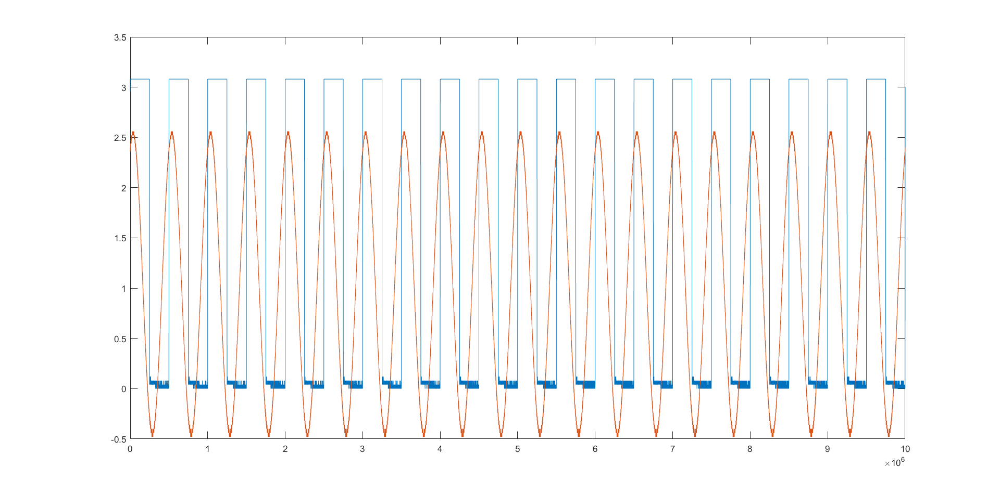

# OWON VDS6000 USB Oscilloscope
Matlab functions to setup and read data from OWON VDS6102 USB oscilloscopes using SCPI commands.

To create the VISA-Session with custom configuration

`os = setup_owon_scope()`

Returns
	os.obj : the instrument object.
	os.settings : the setting structure

Once created, you can modify os.settings values and configure the instrument with the new values

`os = setup_owon_scope(os)` 

To check the configuration:

`fopen(os);`

`current_settings = check_owon_config(os);`

To get ADC data from the instrument:

`fopen(os); fprintf(os, ':RUN');` (to Run the instrument and acquire data)

`fprintf(os, ':STOP');`	(the best practice is to stop the instrument)

`[data, ~] = get_owon_data(os)`

`sample_rate = data.sample_rate`

`waveform_points = data.points`

Example of the waveforms captured from both channels with their respective offset

